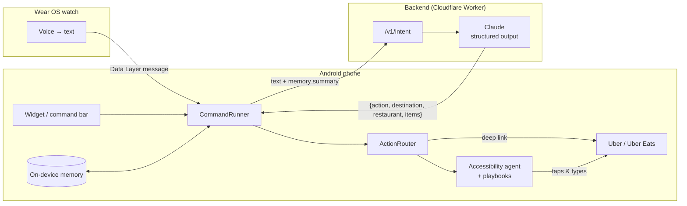

# Vecto

**Tell your phone what you want. It does the tapping.**

Vecto is an AI agent that operates the apps already on your Android phone. Say *"cab home"* or
*"the usual from Dishoom"* from a home-screen widget or your watch, and Vecto opens Uber or Uber Eats,
navigates the app for you, and stops at the final screen so you confirm with one tap.

No new phone, no custom OS, no app-by-app integrations: it works on the phone you already own, today.

```
"order the usual from Dishoom"   (widget, command bar, or watch)
        │
        ▼
Vecto understands it  →  remembers your usual  →  opens Uber Eats  →  searches, adds items  →  you tap Pay
```

## Why

Every task on a phone is a sequence of taps across screens someone else designed. Assistants can answer
questions, but they still can't *do* things in the apps people actually use. Vecto closes that gap with
an agent that drives real app UIs, starting with the two flows people repeat most: getting a ride and
ordering food.

## What works today

| | |
|---|---|
| **Home-screen widget** | One tap opens a command bar; shortcut chips like "Cab home". |
| **Voice from the watch** | A Wear OS app that listens instantly and hands the command to the phone. |
| **Rides** | Opens Uber with the drop-off filled in. You pick the ride and confirm. |
| **Food** | Opens Uber Eats and runs a scripted agent: search, open restaurant, add items, stop at basket. |
| **On-device memory** | Learns frequent places and usual orders; "remember I'm vegetarian" stores a fact. Viewable and deletable in the app. |
| **Live status + Stop** | A floating pill shows each step the agent takes, with a Stop button. |
| **Safety by design** | The agent never pays. It stops before any money moves. |

## How it works



1. **Understand.** The command and a compact summary of on-device memory go to a stateless backend,
   which uses Claude with a strict output schema to return a structured action.
2. **Act.** Deep links get as close as possible (Uber opens with the destination set). For steps a link
   can't do, an Android accessibility service runs a scripted **playbook** against the live UI:
   deterministic, fast, and free, with no model call per tap.
3. **Remember.** Outcomes are written back to memory on the phone, so "the usual" and frequent
   destinations get better with use.

More detail in [docs/ARCHITECTURE.md](docs/ARCHITECTURE.md).

## Privacy

- **Memory never leaves the phone.** The backend receives a short summary with each command and stores nothing.
- **No accounts.** An anonymous device ID is used only for rate limiting.
- **Scoped access.** The accessibility service is restricted to Uber and Uber Eats; Vecto can't see other apps.
- **Always in control.** Every step is visible, Stop works at any point, and payment is always yours.

## Repository layout

```
android/
  app/        Phone app: widget, command bar, agent, playbooks, memory, watch bridge
  wear/       Wear OS app: voice capture → phone
backend/      Cloudflare Worker: /v1/intent → Claude structured output (+ free mock parser for dev)
docs/         Architecture notes
```

**Stack:** Kotlin, Jetpack Compose, Glance (widget), Wear Compose, Wear OS Data Layer,
AccessibilityService · TypeScript, Cloudflare Workers, Anthropic SDK, Zod.

## Running it

**Backend**
```sh
cd backend
npm install
npm run dev                 # http://localhost:8787
```
Without an API key the backend uses a built-in keyword parser (`cab to …`, `order from …`,
`the usual from …`, `remember …`), so the whole app can be tried for free. To use Claude, put
`ANTHROPIC_API_KEY=…` in `backend/.dev.vars`.

**Apps**
1. Open `android/` in Android Studio and sync.
2. Run the `app` configuration on a phone or emulator. Debug builds call `http://10.0.2.2:8787`
   (the host machine, from the emulator); set `BACKEND_URL` for a deployed backend.
3. In Vecto: add the widget, enable **Vecto actions** under Accessibility, and save a home address.
4. Optional: run the `wear` configuration on a paired Wear OS watch. Debug builds of both apps share a
   signing key, which the Data Layer requires.

**Deploy the backend**
```sh
cd backend
npx wrangler secret put ANTHROPIC_API_KEY
npx wrangler kv namespace create RATE_LIMIT   # add the id to wrangler.toml
npm run deploy
```

## Roadmap

- **Confirm-and-place:** read the total from screen, confirm in Vecto (or on the watch), agent taps Pay.
- **Reliability:** per-step recovery with a model fallback when a playbook meets an unexpected screen.
- **On-device intelligence:** handle simple commands with an on-device model over the same memory:
  offline, instant, free.
- **More flows:** groceries, restaurant bookings, bill payments, chosen by what users repeat most.

## Status

Early prototype under active development. Phone and watch apps build; flows are being tuned on real
devices in London.
