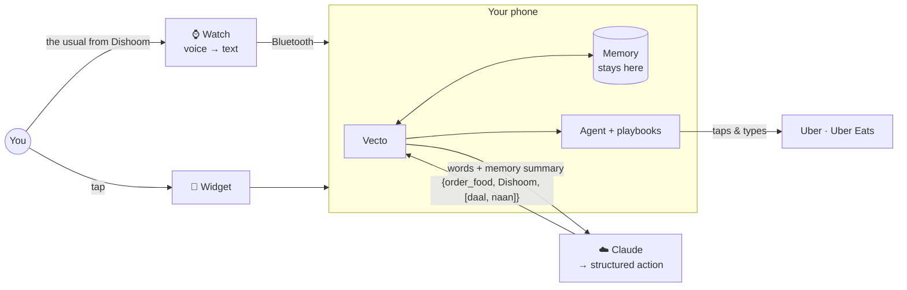

<div align="center">

# Vecto

### You say it. Your phone does it.

*An AI agent that uses your apps for you, from a home-screen widget or your wrist.*

</div>

---

It's 11pm. You're starving. You know exactly what you want: the same black daal and garlic naan you
always get from Dishoom.

So you unlock your phone. Find Uber Eats. Wait for it to load. Dismiss the promo. Tap search. Type
"dish". Tap Dishoom. Scroll past the specials. Find the daal. Add. Back. Find the naan. Add. Basket.
Checkout.

**A dozen or so taps to say something you could say in five words.**

With Vecto, you lift your wrist and say *"the usual from Dishoom."*
Your phone opens Uber Eats, finds the restaurant, fills the basket, and waits for you to tap Pay.

That's it. That's the product.

---

## The idea

Phones got smart, but using them didn't get easier. Every task is still a maze of screens designed by
someone else, and you're the one walking it, tap by tap.

Assistants can tell you the weather. They can't get you a cab.

Vecto is built on a simple bet: **the next interface for your phone is the phone doing the work
itself.** Not a new device. Not a new operating system. An agent that drives the apps you already have,
on the phone already in your pocket.

We're starting with the two things people do on repeat: **getting a ride** and **ordering food**.
Nail those, then go everywhere.

## What it feels like

| You say | Vecto does |
|---|---|
| *"Cab home"* | Opens Uber with your home address already set. You pick the ride and go. |
| *"Cab to King's Cross"* | Same thing, anywhere in London. |
| *"Order from Dishoom"* | Opens Uber Eats, searches, and drops you on the menu. |
| *"The usual from Dishoom"* | Remembers what you ordered last time and fills the basket. |
| *"Remember I'm vegetarian"* | Writes it down (on your phone, not our servers). |

Ask from the **home-screen widget**, the **command bar**, or your **Wear OS watch**. Same brain,
same memory, whichever you grab first.

While it works, a little floating pill shows every step (*"3/5 · Opening Dishoom"*) with a big
**Stop** button. You're always in control.

## How it works

Vecto is four pieces working together:

**The ears (watch).** A tiny Wear OS app. Raise your wrist, speak, done. The watch turns your voice into
text and hands it to your phone over Bluetooth. No watch login, no watch internet.

**The brain (backend).** Your words plus a short summary of what Vecto remembers go to a small stateless
server. Claude turns them into a precise, structured action like
`{order_food, "Dishoom", ["Black Daal", "Garlic Naan"]}`. That's one model call per command, not one per tap.

**The hands (agent).** On the phone, Vecto takes the fastest route available. If an app supports deep
links, it jumps straight to the right screen. If not, an Android accessibility service drives the real
app UI with a scripted **playbook**: find this, tap that, type here. It's fast, predictable, and costs
nothing per tap.

**The memory (on-device).** Every command and how it went is saved on your phone. Vecto learns your
usual places and usual orders, so it gets better the more you use it. You can see all of it, and delete
it, in the app.



Want the deep dive? See [docs/ARCHITECTURE.md](docs/ARCHITECTURE.md).

## Things Vecto will never do

- **Pay for you without asking.** Every flow stops at the final screen. The last tap is yours.
- **Act on its own.** It only moves when you give it a command.
- **Snoop.** Its accessibility access is scoped to the apps it supports, and it only reads the
  screen while running a command you started.
- **Upload your life.** Memory lives on your phone. The server gets a short summary per command and keeps nothing.
- **Make you sign up.** No account, no password, no API key.

## Questions people ask

**Isn't this just a voice assistant?**
Voice assistants answer questions. Vecto operates apps: it opens them, navigates them and fills them in,
the way you would, just faster.

**Why not wait for Apple or Google to build this into the OS?**
They're working on it, and it'll arrive first on the newest flagship phones. Vecto runs on the Android
phone you already have, today, including the affordable ones most people actually own.

**Why an accessibility service?**
It's the official Android way for software to see and operate on-screen controls, the same mechanism
screen readers use. Vecto uses it narrowly and visibly, only in the apps it supports.

**Why only Uber and Uber Eats?**
Because two flows that work every single time beat twenty that work sometimes. Reliability first,
breadth second.

**What happens when Uber redesigns their app?**
A playbook step fails, the agent stops and hands control back to you, and it logs the new screen layout
so the playbook can be fixed quickly. Model-driven recovery for unexpected screens is on the roadmap.

## Try it yourself

You'll need Android Studio and Node.js. No API key required to get started.

```sh
# 1. Start the brain (runs locally; uses a free built-in parser if there's no API key)
cd backend && npm install && npm run dev

# 2. Build the phone + watch apps
cd android && ./gradlew assembleDebug
```

Then open `android/` in Android Studio, run the **app** configuration, add the widget, switch on
**Vecto actions** in Accessibility settings, and say something. For the watch, run the **wear**
configuration on a paired Wear OS watch.

To use Claude instead of the built-in parser, put `ANTHROPIC_API_KEY=…` in `backend/.dev.vars`.

<details>
<summary><b>Deploying the backend</b></summary>

```sh
cd backend
npx wrangler secret put ANTHROPIC_API_KEY
npx wrangler kv namespace create RATE_LIMIT   # add the id to wrangler.toml
npm run deploy
```
Then point `BACKEND_URL` in `android/app/build.gradle.kts` at the deployed URL.

</details>

<details>
<summary><b>What's in the box</b></summary>

```
android/
  app/        Phone: widget, command bar, agent, playbooks, memory, watch bridge
  wear/       Watch: voice in, status out
backend/      Cloudflare Worker: words → Claude → structured action
docs/         Architecture deep dive
```

**Built with:** Kotlin · Jetpack Compose · Glance · Wear Compose · Wear OS Data Layer ·
Android AccessibilityService · TypeScript · Cloudflare Workers · Claude · Zod

</details>

## What's next

- **One-tap checkout.** Vecto reads the total off the screen and asks *"£18.40 from Dishoom, to home?"*
  You tap yes on your phone or watch, and it places the order.
- **Self-healing flows.** When an app surprises the playbook, the agent asks the model what to do next
  instead of giving up.
- **A brain on the phone.** Simple commands handled by an on-device model: instant, offline, free.
- **Everything else you do on repeat.** Groceries, table bookings, bills. We'll follow whatever users
  ask for most.

## Where it's at

Early, scrappy, and real. The phone and watch apps build, and the flows are next up for tuning on real
phones in London. If you want to try it, break it, or tell us which task you'd automate first,
[open an issue](../../issues).
