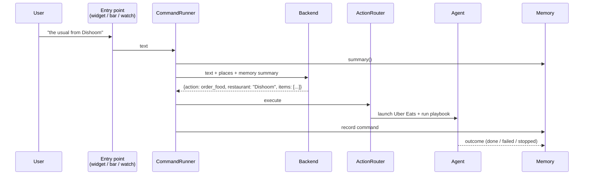
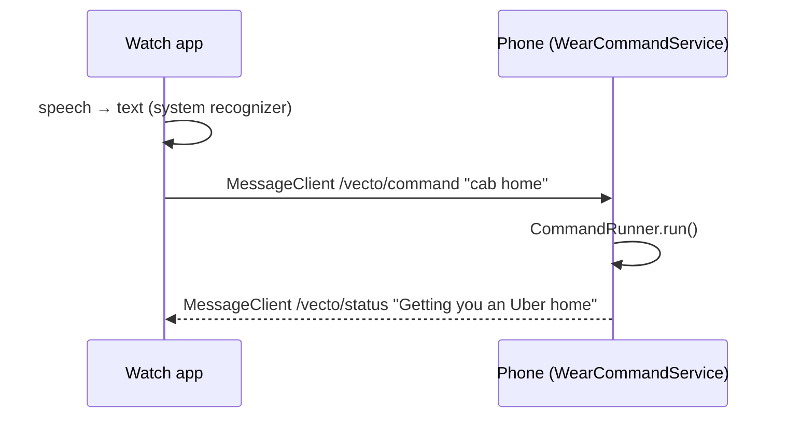

# Architecture

Vecto has three parts: a phone app that does the work, a watch app that captures voice, and a small
stateless backend that turns language into a structured action.

## One pipeline for every entry point

Every command, whether it comes from the widget, the command bar or the watch, goes through
`CommandRunner` (`android/app/.../command/CommandRunner.kt`):



Having one path means memory, analytics and safety rules apply identically however the user asks.

## Understanding: backend

`backend/src/index.ts` is a Cloudflare Worker with one route, `POST /v1/intent`.

- **Input:** `{deviceId, text, places, memory}`, validated with Zod.
- **Model call:** a single Claude request with a fixed system prompt (per-request data goes in the user
  message) and a **structured output schema**, so the response is always a valid `ParsedCommand`:
  `{action, destination, restaurant, items, fact, message}`.
- **Stateless:** nothing is persisted except a per-device daily counter for rate limiting.
- **Dev mode:** with no API key, a keyword parser returns the same shape, so the apps can be developed
  and demoed without model costs.

Choosing a structured action (rather than letting the model drive every tap) keeps the expensive, slow,
non-deterministic step to **one call per command**.

## Acting: deep links + accessibility playbooks

`ActionRouter` picks the most reliable mechanism available:

1. **Deep links first.** Rides use Uber's universal link with the drop-off pre-filled. No automation needed.
2. **Playbooks for the rest.** Food ordering needs in-app navigation, so the router starts Uber Eats and
   hands a `Playbook` to the `Agent`.

A playbook is a list of `Step`s. Each step polls the live accessibility tree until its condition succeeds
or it times out (`agent/Agent.kt`):

```kotlin
Step("Opening $restaurant", settleMs = 2_500) { it.clickText(restaurant) }
```

- **Deterministic and cheap:** no model call per tap; a flow takes seconds.
- **Observable:** `StatusOverlay` shows `step i/n` with a Stop button, drawn as an accessibility overlay
  (no extra permission).
- **Debuggable:** when a step fails, the full screen tree is logged (`VectoService` tag) so labels can be
  corrected quickly when a target app changes.
- **Bounded:** the accessibility service is scoped to the target apps' packages, and playbooks end before
  checkout.

Planned: a model fallback for steps that time out (send the screen tree, get the next action), used only
when the script can't proceed.

## Remembering: on-device memory

`memory/MemoryStore.kt` keeps a small JSON document in app-private storage:

- **History:** each command, its parsed action and its outcome (`opened`, `done`, `failed`, `stopped`).
- **Facts:** things the user asked Vecto to remember.
- **Derived signals:** frequent destinations, restaurants with their last order, computed from
  successful history only.

Only `summary()` (top places, top restaurants, facts) accompanies a command. The backend uses it to resolve
references like "the usual" or "the gym", and discards it. Users can inspect and delete memory in the app.

This store is also the foundation for on-device inference: a local model can read the same memory to
handle simple commands without a network round-trip.

## Voice from the wrist: watch bridge



- The watch does only capture and display; the phone owns logic, memory and credentials.
- Transport is the Wear OS Data Layer (Bluetooth / Wi-Fi), so no watch-side network or login is needed.
- Opening an app from `WearCommandService` is a background activity start, which Android permits because
  Vecto's accessibility service is system-bound. Watch commands therefore require it to be enabled.

## Safety principles

1. **User-initiated only.** The agent runs only in response to an explicit command.
2. **Never moves money.** Flows stop at the confirm/checkout screen.
3. **Visible and interruptible.** Every step is shown; Stop always works.
4. **Least access.** Accessibility scoped to supported apps; memory stays on the device.
